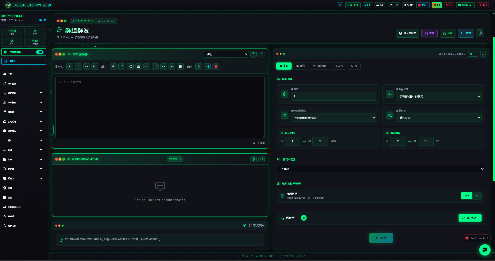
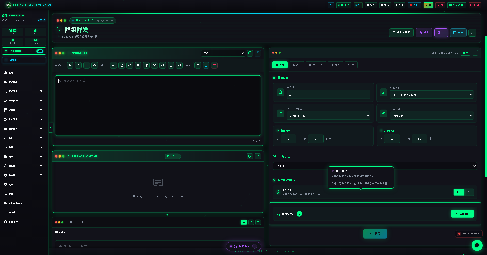
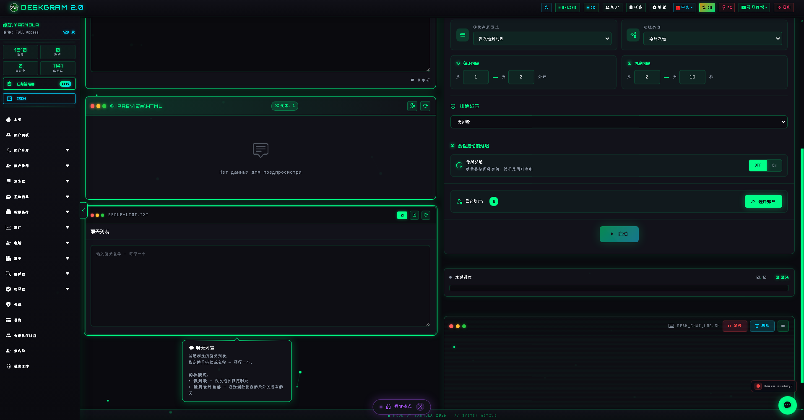
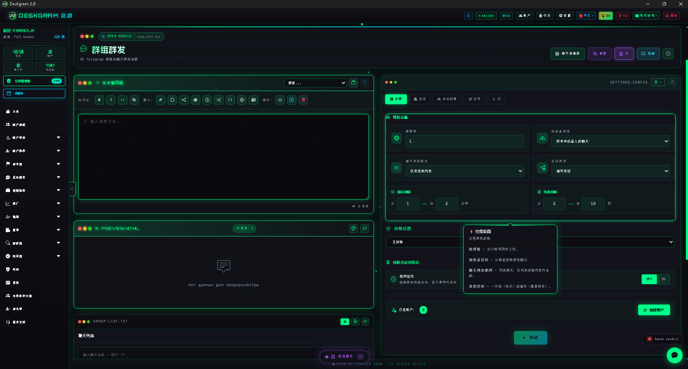

# Deskgram 2 Telegram 群聊消息模块

Deskgram 2 的群聊消息模块可以把准备好的消息发送到现有聊天和群组里，并且同时管理聊天列表、排除列表、发送设置、自动回复和 AI 选项。

[Deskgram 2 Hub](https://github.com/Deskgram-2/deskgram-2-telegram-automation-zh) · [Website](https://deskgram2.com/) · [Telegram Bot](https://t.me/DG2welcomebot) · [Web Preview](https://deskgram2.com/web-preview?path=%2Fapp-demo%2F&lang=cn)

## 交互式 Web Preview

在浏览器里查看模块界面：[打开 web preview](https://deskgram2.com/web-preview?path=%2Fapp-demo%2Ffunctions%2Fspam_chat&lang=cn)

## Screenshots

## 模块概览

| 参数 | 内容 |
|---|---|
| 核心任务 | 向现有 Telegram 聊天和群组发送消息 |
| 重要模块 | 消息构造器、聊天列表、排除逻辑、设置标签、自动回复、AI |
| 适用场景 | 社区触达、群聊运营、支持型或 engagement 路线 |
| 相关模块 | 私信群发、关键词订阅、聊天预热、任务管理 |

## 模块能力

- 向现有聊天和群组发送准备好的消息；
- 在纯列表模式和排除列表模式之间切换；
- 控制性能、延迟和发送逻辑；
- 在同一路线里连接自动回复和 AI 设置；
- 把群聊讨论作为独立执行层，而不是只依赖私信。

## 快速开始

1. 在构造器里准备消息。
2. 整理聊天列表或排除列表。
3. 配置性能、延迟和发送逻辑。
4. 需要时开启自动回复或 AI 选项。
5. 启动模块并通过日志和统计观察结果。

## Related repositories

- [Deskgram 2 Hub](https://github.com/Deskgram-2/deskgram-2-telegram-automation-zh)
- [私信群发](https://github.com/Deskgram-2/telegram-direct-messaging-deskgram-zh)
- [关键词订阅](https://github.com/Deskgram-2/telegram-keyword-subscriptions-deskgram-zh)
- [聊天预热](https://github.com/Deskgram-2/telegram-chat-warmup-deskgram-zh)
- [任务管理](https://github.com/Deskgram-2/telegram-task-manager-deskgram-zh)

## FAQ

### 可以先在浏览器里看模块吗？

可以。web preview 已经展示了消息构造器、聊天列表和主要设置标签。

### 这和私信群发一样吗？

不一样。这里的重点是现有群聊和社区讨论，而不是一对一私信路线。
